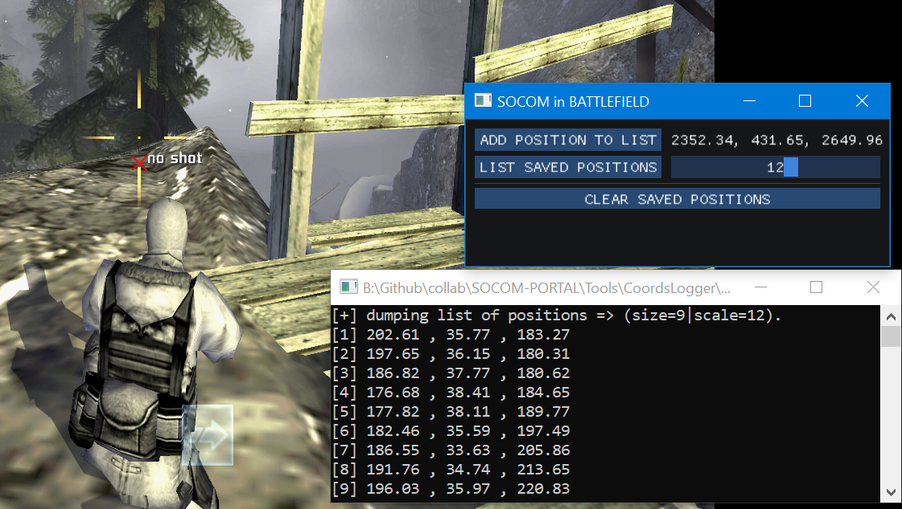
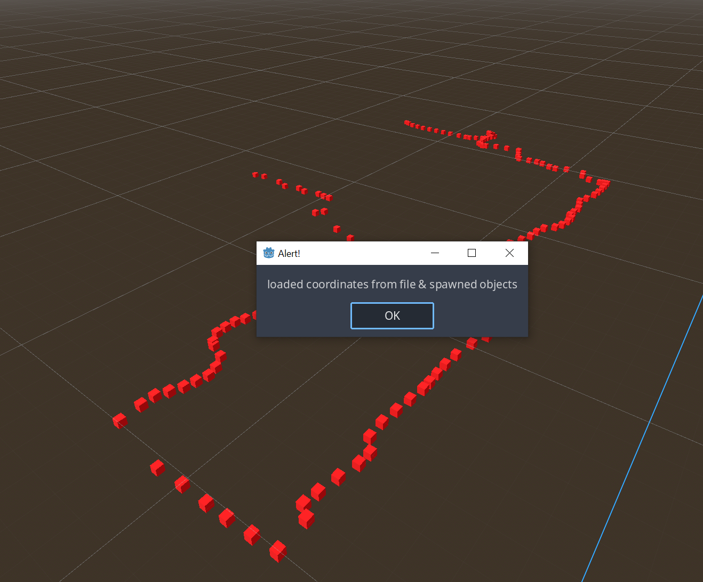

# SealTools

[](https://www.youtube.com/channel/UCEZdYkN1i18H8hz1PT6Mx9A)
[](https://discord.gg/JCCMpXhYWc)

A comprehensive toolkit for SOCOM map reconstruction and analysis. This project provides tools to capture in-game coordinates from PCSX2 and visualize them for map creation and analysis.

## 🛠️ Tools

### SealLogger
A real-time coordinate logger for SOCOM (SOCOM II & SOCOM: Combined Assault) running on PCSX2. SealLogger attaches to the PCSX2 emulator process and captures player position data for map reconstruction.
<p align="center">
  <a href="https://github.com/SOCOM-in-BATTLEFIELD/SealTools">
    
  </a>
</p>

**Features:**
- Real-time coordinate capture from PCSX2
- Support for both SOCOM II and SOCOM: Combined Assault
- Force start functionality for LAN matches
- Adjustable coordinate scaling
- Export coordinates to CSV format
- ImGui-based user interface

**Usage:**
1. Launch PCSX2 and load SOCOM II or SOCOM: Combined Assault
2. Run `SealLogger.exe`
3. Enable "SOCOM CA" checkbox if using Combined Assault
4. Join or create a match
5. Use "ADD POSITION TO LIST" to capture coordinates
6. Use "LIST SAVED POSITIONS" to export captured data

### SealMapper
A Godot plugin that imports coordinate data exported from SealLogger, enabling visual map reconstruction and analysis within the Godot engine.
<p align="center">
  <a href="https://github.com/SOCOM-in-BATTLEFIELD/SealTools">
    
  </a>
</p>

**Features:**
- Import CSV coordinate data from SealLogger
- Automatically spawn 3D markers at captured positions
- Visual map reconstruction in Godot's 3D viewport
- Customizable marker appearance
- Dock integration for easy access
- Real-time coordinate visualization

**Installation:**
1. Copy the `SealMapper` folder to your Godot project's `addons/` directory
2. In Godot, go to **Project → Project Settings → Plugins**
3. Enable the **SealMapper** plugin
4. The SealMapper dock will appear in the bottom-left panel

**Usage:**
1. Export coordinates from SealLogger to a CSV file
2. Place the CSV file at `res://addons/SealMapper/coordinates.csv` (or configure custom path)
3. Click the **SealMapper** button in the dock
4. 3D markers will be spawned at each coordinate position in your current scene

## 🚀 Getting Started

### Prerequisites

**For SealLogger:**
- Windows OS
- PCSX2 emulator
- SOCOM II or SOCOM: Combined Assault ISO

**For SealMapper:**
- Godot 4.x

### Installation

**SealLogger:**
1. Download the latest release from the [Releases](../../releases) page
2. Extract the archive
3. Run `SealLogger.exe`

**SealMapper:**
1. Download the SealMapper plugin from the [Releases](../../releases) page
2. Extract to your Godot project's `addons/` directory
3. Enable the plugin in Godot's Project Settings → Plugins

## 🔧 Building from Source

### SealLogger
Requirements:
- Visual Studio 2022 or later
- Windows SDK

Build steps:
```powershell
cd SealLogger
# Open CoordsLogger.slnx in Visual Studio and build
```

### SealMapper
No build required - simply copy the plugin files to your Godot project's `addons/` directory.

## 📝 Coordinate Export Format

Coordinates are exported in CSV format:
```
x,y,z
```

The coordinates are automatically scaled by the specified scale factor (default: 12).

## 🤝 Contributing

Contributions are welcome! Please feel free to submit pull requests or open issues for bugs and feature requests.

## 📄 License

This project is licensed under the terms specified in the [LICENSE](LICENSE) file.

## 🔗 Dependencies

- [Dear ImGui](https://github.com/ocornut/imgui) - UI framework
- [exMemory](https://github.com/NightFyre/exMemory) - Memory reading library with PCSX2 extensions

## ⚠️ Disclaimer

This tool is designed for educational and personal use with legally obtained game copies. Users are responsible for complying with all applicable laws and terms of service.
